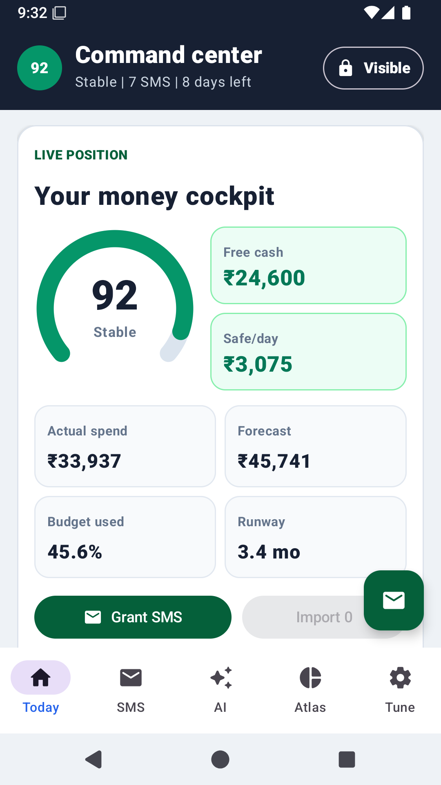
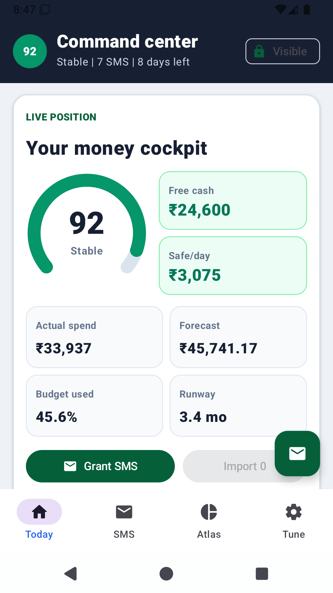

# Cashflow Atlas: Local-First Financial Fortress

**Cashflow Atlas** is a high-performance, native Android application designed to transform bank SMS alerts into a visual, proactive financial map. Built with a "Privacy First" philosophy, it processes all sensitive financial data entirely on-device with zero internet dependencies.

---

## 🚀 Advanced Intelligence Suite

Beyond simple expense tracking, Cashflow Atlas provides professional-grade financial analytics:

### 1. Predictive Forecasting & "Ghost Bars"
The engine calculates your real-time spending pace based on the day of the month. In **Risk Scan** mode, the app renders "Ghost Bars" showing where you are projected to be at the end of the month, allowing you to catch budget overruns before they happen.

### 2. Merchant Intelligence Map
A custom-built bubble visualization that aggregates spending by individual merchants. It uses a spiral layout to highlight your top spend locations, providing instant clarity on where your money is concentrated.

### 3. Savings Optimizer
The optimizer identifies discretionary vs. essential spending. It provides dynamic "What-If" scenarios, calculating exactly how many months faster you can reach your savings goal by reducing non-essential spend by just 25%.

### 4. Intelligence Sentinel (Anomaly Detection)
An automated security guard for your ledger that:
- **Detects Duplicates**: Flags potential double-billing or duplicate manual entries.
- **Security Scanner**: Monitors incoming SMS for high-risk keywords like "unauthorized", "blocked", or "suspicious" activities.

---

## 🛡️ Security & Privacy Fortress

Cashflow Atlas is built to be a digital vault for your finances:

- **Anti-Spyware Shield**: Uses system-level `FLAG_SECURE` to block all screenshots and screen recordings, protecting your data from malicious background apps.
- **Stealth Mode (Privacy Mask)**: A one-tap toggle in the title bar that masks all currency figures across the entire UI. Perfect for reviewing your finances in public spaces.
- **PII Scrubber**: Automatically redacts Personally Identifiable Information (Account numbers, card numbers) from SMS body text before it is ever stored.
- **No Internet Permission**: Verified through the Android Manifest—the app physically cannot send your data to any server.

---

## 📊 Visual Atlas

The heart of the app is a custom native Canvas visualization with three distinct modes:
- **Flow View**: A Sankey-inspired flow showing Income splitting into Savings and Spending.
- **Risk Scan**: A bar-chart dashboard comparing Budget vs. Actual vs. Forecast.
- **Merchant Map**: A bubble-chart aggregate of your top spend locations.

---

## 🛠️ Technical Details

- **Language**: 100% Plain Java (Modern Android patterns)
- **UI Architecture**: Native View system with custom `Canvas` drawing for high-performance charts.
- **Gradle**: Updated to **9.4.1**
- **Persistence**: Encrypted local storage using `AndroidKeyStore` (AES/GCM/NoPadding).
- **Dependencies**: Minimal footprint with no heavy frameworks (No Compose, No AndroidX dependencies required).

---

## 🏁 Getting Started

1. **Open** the project in Android Studio.
2. **Build** using the `app` configuration.
3. **Grant READ_SMS** to enable automatic inbox scanning, or use the **Manual Paste** fallback.
4. **Import Sample Data** to instantly see the AI Forecasting and Merchant Map in action.

---

*Developed by Shreyes Mohan - Empowering financial clarity through local-first intelligence.*
